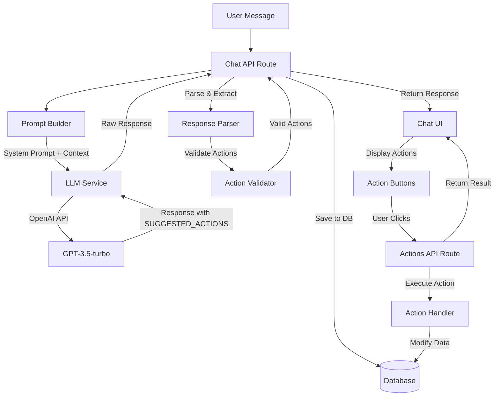

# Tool/Action Calling Implementation Breakdown

## Overview

The LLM-powered assistant uses a **text-based tool calling** approach where the LLM generates structured JSON actions in its response, which are then parsed, validated, and executed by the backend. This document explains how the system works and how to add new tools.

## Architecture Flow



## Step-by-Step Implementation Breakdown

### Step 1: Define Actions in Prompt Builder

**File:** `apps/frontend/lib/assistant/prompt-builder.ts`

Actions are defined in the `ALLOWED_ACTIONS` array:

```typescript
const ALLOWED_ACTIONS = [
  {
    type: "create_monitor",
    required: ["name", "url"],
    optional: ["timeout", "checkInterval", "expectedStatusCodes", "escalationPolicyId"],
  },
  {
    type: "pause_monitor",
    required: ["monitorId"],
  },
  // ... more actions
];
```

**Purpose:** This array serves two purposes:
1. Documents available actions for the LLM
2. Provides validation schema for action parameters

### Step 2: System Prompt Construction

**File:** `apps/frontend/lib/assistant/prompt-builder.ts` → `buildSystemPrompt()`

The system prompt instructs the LLM on:
- Its role and behavior
- How to format actions
- When to suggest actions
- What actions are available

**Key Instructions:**
```
"When proposing executable actions, append a JSON block on its own line in this exact format:
SUGGESTED_ACTIONS:
[{ "type": "<action_type>", "label": "<short label>", "confirm": false, "data": { /* required fields */ } }]"
```

**Context Injection:**
- User's monitor count
- Recent incidents count
- Focused context (if viewing specific monitor/incident)

### Step 3: LLM Response Generation

**File:** `apps/frontend/lib/assistant/llm-service.ts` → `generateAssistantReply()`

**Process:**
1. Builds context using `buildAssistantContext()` (fetches user data, monitors, incidents)
2. Builds system prompt with action definitions
3. Constructs message array with:
   - System prompt
   - Context JSON (as system message)
   - Conversation history
   - User's current message
4. Calls OpenAI API with temperature=0.6, max_tokens=600
5. Returns raw response content

**Example LLM Response:**
```
I can help you create a monitor. Here's what I'll set up:

- Name: My API
- URL: https://api.example.com
- Check interval: 5 minutes

SUGGESTED_ACTIONS:
[{"type": "create_monitor", "label": "Create Monitor", "confirm": false, "data": {"name": "My API", "url": "https://api.example.com", "checkInterval": 300}}]
```

### Step 4: Action Extraction

**File:** `apps/frontend/app/api/assistant/chat/route.ts`

**Process:**
1. Searches for `SUGGESTED_ACTIONS:` marker in LLM response
2. Extracts JSON block after marker
3. Parses JSON array
4. Removes action block from visible message content
5. Validates each action against `ACTION_SPECS`

**Code Flow:**
```typescript
const marker = "SUGGESTED_ACTIONS:";
const markerIndex = assistantContent.lastIndexOf(marker);
if (markerIndex !== -1) {
  const actionsBlock = assistantContent.slice(markerIndex + marker.length).trim();
  const parsed = JSON.parse(actionsBlock);
  // Validate and filter actions
}
```

### Step 5: Action Validation

**File:** `apps/frontend/app/api/assistant/chat/route.ts`

**Validation Rules:**
- Action type must exist in `ACTION_SPECS`
- All required fields must be present and non-empty
- Optional fields are allowed but not validated

**Validation Code:**
```typescript
const validatedActions = suggestedActions.filter((action) => {
  const spec = ACTION_SPECS[action.type];
  if (!spec) return false;
  const data = action.data || {};
  return spec.required.every(
    (field) => data[field] !== undefined && data[field] !== null && data[field] !== ""
  );
});
```

### Step 6: Response Storage

**File:** `apps/frontend/app/api/assistant/chat/route.ts`

**Process:**
1. Saves user message to `ConversationMessage` table
2. Saves assistant message with:
   - Content (without SUGGESTED_ACTIONS block)
   - Metadata containing:
     - `suggestedActions`: Validated actions array
     - `contextUsed`: Context snapshot used for generation
3. Updates conversation `updatedAt` timestamp

### Step 7: UI Display

**File:** `apps/frontend/components/assistant/chat-assistant.tsx`

**Process:**
1. Receives `ChatResponse` with message and metadata
2. Displays assistant message content
3. Renders action buttons from `metadata.suggestedActions`
4. Shows action preview (data being sent)
5. Disables actions if required fields are missing

**Action Button Rendering:**
```typescript
{actions.map((action) => (
  <Button
    onClick={() => handleActionClick(action, msg.id)}
    disabled={missing.length > 0}
  >
    {action.label || action.type}
  </Button>
))}
```

### Step 8: Action Execution

**File:** `apps/frontend/app/api/assistant/actions/route.ts`

**Process:**
1. Receives POST request with `actionType` and `actionData`
2. Validates user authentication
3. Routes to appropriate handler function based on `actionType`
4. Handler function:
   - Validates required parameters
   - Checks user ownership/permissions
   - Executes database operation
   - Returns result
5. Returns success/error response

**Handler Pattern:**
```typescript
async function handleActionName(userId: string, data: Record<string, unknown>) {
  // 1. Validate required fields
  // 2. Check permissions
  // 3. Execute operation
  // 4. Return result
}

switch (actionType) {
  case "action_name":
    result = await handleActionName(user.id, actionData);
    break;
}
```

### Step 9: Frontend Action Handling

**File:** `apps/frontend/components/assistant/chat-assistant.tsx` → `handleActionClick()`

**Process:**
1. Shows confirmation dialog if `action.confirm === true`
2. Sets pending state
3. Calls `/api/assistant/actions` with action type and data
4. Displays success/error status
5. Optionally refreshes context or updates UI

## Current Action Types

### Write Actions (Modify Data)

1. **create_monitor** - Create a new monitor
   - Required: `name`, `url`
   - Optional: `timeout`, `checkInterval`, `expectedStatusCodes`, `escalationPolicyId`

2. **pause_monitor** - Pause a monitor
   - Required: `monitorId`

3. **resume_monitor** - Resume a paused monitor
   - Required: `monitorId`

4. **delete_monitor** - Delete a monitor
   - Required: `monitorId`

5. **create_escalation_policy** - Create escalation policy
   - Required: `name`
   - Optional: `levels`

6. **remove_escalation_policy** - Delete escalation policy
   - Required: `escalationPolicyId`

7. **edit_escalation_policy** - Update escalation policy
   - Required: `escalationPolicyId`
   - Optional: `name`, `enabled`, `levels`

8. **acknowledge_incident** - Acknowledge an incident
   - Required: `incidentId`

9. **resolve_incident** - Resolve an incident
   - Required: `incidentId`

### Read Actions (View Data)

10. **view_incident_timeline** - View incident timeline
    - Required: `incidentId`
    - Note: Currently returns data but doesn't display it in UI

## Missing Tool Types

The current implementation focuses on **write actions** (modifications). However, for better context awareness, we need **read-only tools** that the LLM can call to fetch data before suggesting actions:

### Read-Only Tools Needed

1. **get_all_monitors** - Fetch all user monitors
   - No parameters needed (uses userId from auth)
   - Returns: Array of monitor objects

2. **get_monitor_data** - Get detailed monitor information
   - Required: `monitorId`
   - Returns: Monitor details with ticks, incidents, status

3. **get_escalation_policies** - List all escalation policies
   - No parameters needed
   - Returns: Array of escalation policies with levels

4. **get_incidents** - Fetch incidents (filtered)
   - Optional: `monitorId`, `status`, `limit`
   - Returns: Array of incident objects

5. **get_status_page_link** - Get status page URL
   - Optional: `statusPageId` (if user has multiple)
   - Returns: Public status page URL

## Key Design Decisions

### 1. Text-Based Tool Calling (Not Function Calling)

**Why:** The system uses text-based tool calling (SUGGESTED_ACTIONS marker) instead of OpenAI's native function calling because:
- More control over format and validation
- Works with any LLM (not OpenAI-specific)
- Easier to debug and inspect
- Allows for custom action metadata (label, confirm)

**Trade-off:** Requires more prompt engineering and parsing logic.

### 2. Action Validation at Multiple Layers

**Why:** Actions are validated at:
1. **LLM Level:** System prompt instructs LLM on valid actions
2. **API Level:** Chat route validates against ACTION_SPECS
3. **UI Level:** Frontend checks required fields before enabling buttons
4. **Handler Level:** Action handlers validate parameters again

**Benefit:** Prevents invalid actions from being executed, even if LLM makes mistakes.

### 3. Context Injection vs Tool Calling

**Current Approach:** Context is injected into every LLM call via system message JSON.

**Limitation:** Context is static and may become stale. Large context increases token usage.

**Better Approach:** Use read-only tools to fetch fresh data on-demand.

## Adding New Tools/Actions

### For Write Actions (Modifications)

1. **Add to ALLOWED_ACTIONS** (`prompt-builder.ts`)
   ```typescript
   {
     type: "new_action",
     required: ["field1", "field2"],
     optional: ["field3"],
   }
   ```

2. **Add to ACTION_SPECS** (`chat/route.ts`)
   ```typescript
   new_action: {
     required: ["field1", "field2"],
     optional: ["field3"],
   }
   ```

3. **Create Handler Function** (`actions/route.ts`)
   ```typescript
   async function handleNewAction(userId: string, data: Record<string, unknown>) {
     // Validation
     // Permission check
     // Execute operation
     // Return result
   }
   ```

4. **Add to Switch Statement** (`actions/route.ts`)
   ```typescript
   case "new_action":
     result = await handleNewAction(user.id, actionData);
     break;
   ```

5. **Update UI Action Specs** (`chat-assistant.tsx`)
   ```typescript
   new_action: { required: ["field1", "field2"] }
   ```

### For Read-Only Tools (Data Fetching)

Read-only tools require a different approach:

1. **Add Tool Definition** (`prompt-builder.ts`)
   ```typescript
   const AVAILABLE_TOOLS = [
     {
       type: "get_monitor_data",
       description: "Fetch detailed information about a monitor",
       required: ["monitorId"],
       returns: "Monitor object with ticks, incidents, status",
     },
   ];
   ```

2. **Update System Prompt** to instruct LLM to call tools when needed
   ```
   "You can call tools to fetch data. When you need information, call the appropriate tool first, then provide your answer based on the tool's response."
   ```

3. **Create Tool Handler** (`actions/route.ts` or new `tools/route.ts`)
   ```typescript
   async function handleGetMonitorData(userId: string, monitorId: string) {
     // Fetch and return monitor data
   }
   ```

4. **Tool Execution Flow:**
   - LLM generates tool call in response
   - Backend executes tool
   - Tool result is fed back to LLM
   - LLM generates final response with actions

## Implementation Challenges

### Challenge 1: LLM May Not Call Tools

**Problem:** LLM might answer from context instead of calling tools for fresh data.

**Solution:** 
- Explicitly instruct LLM to call tools when data is needed
- Provide examples in system prompt
- Use few-shot prompting

### Challenge 2: Tool Call Format

**Problem:** Need consistent format for tool calls vs actions.

**Solution:**
- Use `TOOL_CALLS:` marker for read-only tools
- Use `SUGGESTED_ACTIONS:` marker for write actions
- Parse both in chat route

### Challenge 3: Multi-Step Tool Execution

**Problem:** LLM might need to call multiple tools before suggesting an action.

**Solution:**
- Support multiple tool calls in one response
- Execute tools sequentially
- Feed results back to LLM in next turn
- Or: Execute tools, then generate final response with actions

## Best Practices

1. **Always validate** action parameters at handler level
2. **Check permissions** - ensure user owns the resource
3. **Provide clear errors** - return descriptive error messages
4. **Log tool calls** - track what tools are being used
5. **Rate limit** - prevent abuse of tool calls
6. **Cache tool results** - for read-only tools, cache when appropriate
7. **Document tools** - clear descriptions help LLM use them correctly

## Future Enhancements

1. **Native Function Calling:** Migrate to OpenAI function calling API
2. **Streaming Tool Results:** Stream tool execution progress
3. **Tool Result Caching:** Cache read-only tool results
4. **Tool Usage Analytics:** Track which tools are most used
5. **Dynamic Tool Registration:** Allow plugins to register tools
6. **Tool Chaining:** Support multi-step tool execution workflows
